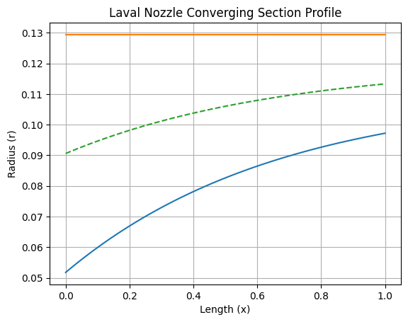

# Compressor Design
Marc Martinez and Benjamin Tollison
### Table of Contents
1. [Design Parameters](#design-parameters)
2. [Annulus Dimensions](#annulus-dimensions)
3. [Mean Velocity Triangles](#mean-velocity-triangles)
4. [Variation of Air Angles Root to Tip](#variation-of-air-angles-root-to-tip)
# How to run the scripts(Optional)
## Cloning a Git Repository using PowerShell

Follow the steps below to clone the repository `https://github.com/BenjaminTollison/417-Design-Project.git` using PowerShell.

### Prerequisites (Windows)

Ensure that you have Git installed on your system. You can verify this by running the following command:

```powershell
git --version
```
Navigate to where you want to download and mess with the repo. I will be creating a folder located in documents as an example:
```powershell
New-Item -Path "$env:USERPROFILE\Documents" -Name "Github" -ItemType Directory
```
```powershell
cd ~/Documents/Github
```
Then clone the repo with
```powershell
git clone https://github.com/BenjaminTollison/417-Design-Project.git
```
Finally open it with your preferred editor such as neovim or vscode by right clicking in file explorer or running these commands
```powershell 
nvim 417-Design-Project.git
```
```powershell 
code 417-Design-Project.git
```
The optional features have been removed from this package due to simplifying the complexity of the design. Reguardless the same python enviornment will be built in case of a revision to the design process. I (Benjamin) have removed my tool that I use for airfoil optimization and we only used the equations that were used in the assigment. 

Due to the Gauss-Bayesian package known as GPyOpt used for my xfoil package, the python version cannot be newer than 3.11.x
(Since that is not the case currently feel free to run any version that is newer than 3.7.x)
### Setting up the virtual environment in Windows Powershell

To create a virtual environment using Python in Windows PowerShell, you can run the following command where "~" is your path to the python install:

```powershell
& ~/Python/Python311/python.exe -m venv design-env
```
Then you want to activate the virtual environment before running any of the calculations with this command that you can just copy and paste.
```powershell
design-env\Scripts\activate
```
Check the version

```powershell
py --version
```
or you might have to referrence your python.exe with "python3" instead, but for the rest of this setup I will only use "py"

```powershell
python3 --version
```

Then we want a clean install of the python packages and remove any that could have transferred from the parent environment with these commands:(Say "y" after it asks you to confirm)
```powershell
py -m uninstall pip
```
```powershell
py -m ensurepip --upgrade
```
The last command for the setup will be:

```powershell
py -m pip install -r requirements.txt
```
This will take a bit to install GPyOpt and the IPython packages. For Grading purposes, feel free to import and display variables and or table in the DesignUnitTest notebook.

## After you are done checking the calculations
Then we want to remove the temporary environment from your system after deactivating the python terminal with:

```powershell
deactivate
```
Then using a file explorer right click and delete the folder. (Windows doesn't like to remove directories from the command line that aren't empty)


# Design Parameters
The items that we will explore are the following:
+ choice of rotational speed and annulus dimensions;
+ determination of number of stages, using an assumed efficiency;
+ calculation of the air angles for each stage at the mean radius;
+ determination of the variation of the air angles from root to tip;
<div style="text-align: center;">

</div>
The example given to already has the number of stages and rotation speed given to us, we will start by defining the annulus shape by creating a function for the hub radius.

# Annulus Dimensions
The first step is going to contrain the cross sectional inlet by the mach number and the hub-tip-ratio by conservation of mass.

$$\dot{m}_{in} = \dot{m}_{out} = \rho_{in} v_{in} \sigma_{in} $$

First to find $\rho_{in}$ with ideal gas assumption
$$\rho_{in} = \frac{P_{01}}{R_{air}T_{01}}$$
Then we can use the equations in the example to find the outer radius:
$$
m = \rho_1 \sigma C_{al} = \rho_1 \pi r_i^2 \left[ 1 - \left( \frac{r_r}{r_t} \right)^2 \right] C_a
$$

$$
C_a = M_{in} \sqrt{\gamma R T_{01}}
$$

$$
r_t^2 = \frac{m}{\pi \rho_1 C_{al} \left[ 1 - \left( \frac{r_r}{r_t} \right)^2 \right]}
$$
$$
\sigma = \pi \left(r_t^2 - r_h^2\right)
$$
$$
r_h^2 = r_t^2 - \frac{\sigma}{\pi}
$$
Due to being a Constant Outer Diameter the $r_{tip}$ is going to be the same at the inlet and the outlet. Also, we need to convert the rpm to usable units in order to get the $U_t$.
$$
N_{rads} = \text{RPM} \times \frac{2 \pi}{60}
$$
$$
N_{rev} = \frac{\text{RPM}}{60}
$$

$$U_T = N_{rads} \times r_{tip} $$

Doing all the following produces this table

|              |           0 | 1                   |          2 |
|:-------------|------------:|:--------------------|-----------:|
| N_rads       | 2686.06     | rads/s              | nan        |
| N_rev        |  427.5      | rev/s               | nan        |
| U_t          |  347.516    | m/s                 | nan        |
| C_a          |  170.131    | m/s                 | nan        |
| inlet_radii  |    0.051751 | 0.09056430561399292 |   0.129378 |
| outlet_radii |    0.110233 | 0.11980539516492981 |   0.129378 |

The temperature at the outlet was found by:
$$
T_{02} = T_{01} \left( \frac{p_{02}}{p_{01}} \right)^{\frac{n-1}{n}}
$$
$$
T_2 = T_{02} - \frac{C_a^2}{2c_p}
$$
# Mean Velocity Triangles
The first assumption that we made was to use a smooth exponential interpolation from the inlet hub to the outlet hub radius calcuated in the previous file. Finding the meaning radius was just as simple as taking the average between the two radii at each x value. Producing the following shape with x being the non-dimensional length of $x = \frac{l}{L_{compressor}}$. That way we didn't have to arbitrarily define the cord lengths per stage.
<div style="text-align: center;">

</div>

The system of equations to find the velocity angles at each stage are the following:
$$
\Delta T_{0s} = \frac{\lambda}{c_p} U C_a \left( \tan \beta_1 - \tan \beta_2 \right)
$$
$$ 
\Lambda = \frac{C_a}{2U}\left(\tan \beta_1 + \tan \beta_2\right)
$$
$$
\frac{U}{C_a} = \tan \alpha_1 + \tan \beta_1
$$
$$
\frac{U}{C_a} = \tan \alpha_2 + \tan \beta_2
$$
That means that we need to define $\Lambda = \Lambda(x)$ and $\lambda = \lambda(x)$. Because the example of Constant Mean Diameter uses discrete numbers that start higher and rapidly decrease in the range of [0,1]. I defined the functions by inlet and outlet values with a scaling factor for an exponential decay model. Below are the following functions.

<div style="text-align: center;">

</div>
<div style="text-align: center;">

</div>

Now that those are defined as what can by call the design hyperparameters by turning the inlet, outlet, and scaling factors manually into the following system of equations scheme. Note that the de Haller criteria is what we used to verify if the angles prevent flow seperation. $\frac{V_2}{V_1} \geq 0.72$

1. 
   $$
   b_1 = \frac{c_p \Delta T_{0s}}{\chi(x) \, U(x) \, C_a}, \quad b_2 = \frac{2 L(x) \, U(x,r)}{C_a}
   $$

2. 
   $$
   \begin{pmatrix}
   \tan \beta \\ \tan \beta_2
   \end{pmatrix}
   =
   \begin{pmatrix}
   1 & -1 \\ 1 & 1
   \end{pmatrix}^{-1}
   \begin{pmatrix}
   b_1 \\ b_2
   \end{pmatrix}
   $$

3. 
   $$
   \begin{pmatrix}
   \beta \\ \beta_2
   \end{pmatrix}
   =
   \tan^{-1} \left(
   \begin{pmatrix}
   1 & -1 \\ 1 & 1
   \end{pmatrix}^{-1}
   \begin{pmatrix}
   b_1 \\ b_2
   \end{pmatrix}
   \right)
   $$

4. 
   $$
   \begin{pmatrix}
   \alpha \\ \alpha_2
   \end{pmatrix}
   =
   \tan^{-1} \left( \frac{U}{C_a} \right) - \tan^{-1} \left( \frac{\beta}{\beta_2} \right)
   $$

5. 
   $$
   \begin{pmatrix}
   cw_1 \\ cw_2
   \end{pmatrix}
   =
   C_a \tan \begin{pmatrix}
   \alpha \\ \alpha_2
   \end{pmatrix}
   $$

6. 
   $$
   \frac{V_{i+1}}{V_i} = \frac{\cos \alpha_i}{\cos \alpha_{i+1}} \quad \text{(de Haller)}
   $$


|    |   $\lambda$ |   $\Lambda$ |   $ \beta_1 $ |   $ \beta_2 $ |   $ \alpha_1 $ |   $ \alpha_2 $ |   $C_{w1}$ |   $C_{w2}$ |   de Haller |   $P_{0S}$ |   $T_{0S}$ |
|---:|------------:|------------:|--------------:|--------------:|---------------:|---------------:|-----------:|-----------:|------------:|-----------:|-----------:|
|  0 |      0.98   |      0.639  |        59.132 |       104.699 |          0.009 |         45.908 |      0.026 |    175.609 |      1.4372 |     1.5476 |     329.8  |
|  1 |      0.9131 |      0.4685 |        57.599 |        84.573 |         18.506 |         53.268 |     56.947 |    227.979 |      1.5856 |     2.2468 |     371.45 |
|  2 |      0.8725 |      0.4196 |        56.803 |        80.387 |         25.387 |         55.7   |     80.739 |    249.407 |      1.6032 |     3.1345 |     413.1  |
|  3 |      0.8479 |      0.4056 |        56.126 |        80.926 |         28.593 |         56.739 |     92.732 |    259.389 |      1.601  |     4.2343 |     454.75 |
|  4 |      0.833  |      0.4016 |        55.616 |        82.309 |         30.322 |         57.265 |     99.506 |    264.649 |      1.5963 |     5.5705 |     496.4  |


# Variation of air angles root to tip